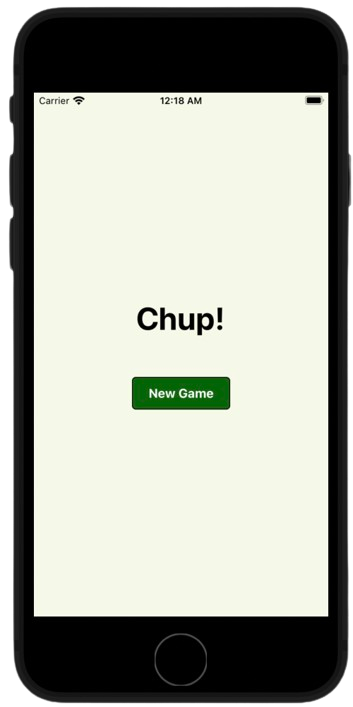
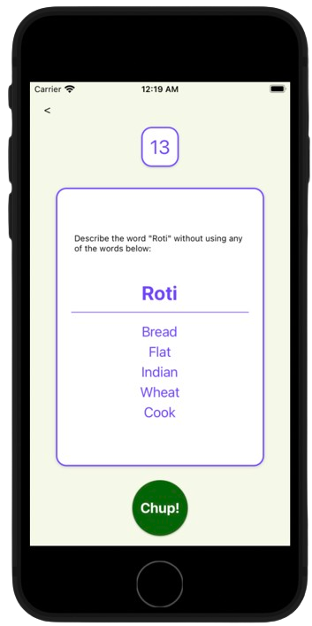

# Chup! Game App

A digital implementation of the classic word-guessing game "Taboo" with a Desi twist, designed for mobile devices using React Native. In this game, players split into teams and try to guess as many words as possible within a given time limit, without using the taboo words listed with each main word.




## How the Game Works

- **Game Setup**: Players enter their names to create their profiles in the app.
- **Team Formation**: Players are divided into two teams, with teams taking turns to play.
- **The Guessing Game**: On each turn, one player gives clues to their team to guess the main word without mentioning the taboo words.
- **Scoring Points**: Points are scored for each correctly guessed word.
- **The Taboo**: If the clue-giver uses a taboo word, the turn ends, and no point is scored for that card.
- **Turn Timer**: Each team's turn is timed. When the timer runs out, play passes to the next team.
- **Winning the Game**: The game ends when all cards have been played, or by choice with 'End Game'. The team with the highest score wins.

## How to Use

1. **Start the App**: Launch the Taboo Game app on your device.
2. **Begin Play**: Press 'New Game' once the app is open.
3. **Gameplay**: Follow the on-screen prompts to play through each turn.
4. **Conclusion**: Use 'End Game' to finish and tally points to determine the winner.

## Running the App Locally

Before starting, ensure you have Node.js and either React Native CLI or Expo CLI installed on your machine.

1. **Clone the Repo**:
   ```sh
   git clone https://github.com/your-username/taboo-game-app.git
2. **Navigate to the Directory**:
   ```sh
   cd taboo-game-app
3. **Install the Dependencies**:
   ```sh
   npm install
4. **Running the App with React Native CLI on iOS**:
   ```sh
   npx react-native run-ios
5. **Running the App with Expo CLI on Android**:
   ```sh
   npx react-native run-android
6. **Running the App with Expo CLI**:
   ```sh
   npx expo start

## Support
If you encounter any problems, please open an issue in the GitHub repository or contact the maintainers directly.

We hope you enjoy the game!
